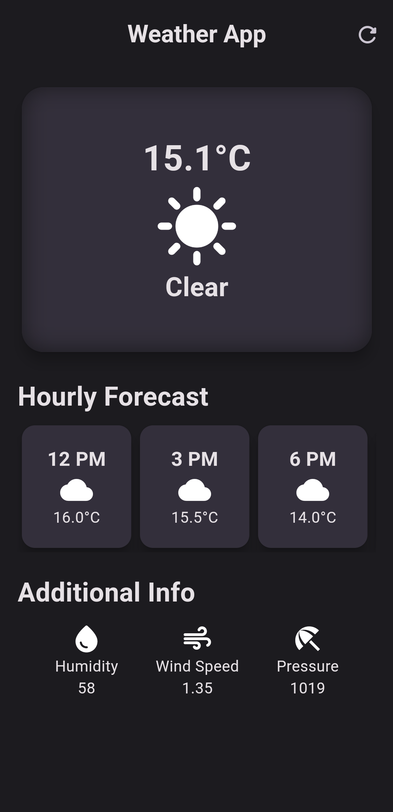

# Weather App

This is a weather application built with Flutter. It fetches data from the OpenWeatherMap API and displays the current weather information and hourly forecast.

## Screenshots



## Components

The main components of the app are:

- `WeatherScreen`: This is the main screen of the app. It fetches the weather data and displays the current temperature, weather condition, hourly forecast, and additional information like humidity, wind speed, and pressure.

- `HourlyForecastItem`: This is a widget that displays the weather forecast for a specific time interval.

- `AdditionalInfoItem`: This is a widget that displays additional weather information like humidity, wind speed, and pressure.

## How it works

When the app is launched, the `main` function in `main.dart` is called, which runs the `WeatherApp` widget. This widget is a `MaterialApp` that sets `WeatherScreen` as its home.

The `WeatherScreen` widget fetches weather data from the OpenWeatherMap API in the `getCurrentWeather` method. This method makes a GET request to the API and returns a `Future<Map<String, dynamic>>` that contains the weather data.

The `build` method of `WeatherScreen` uses a `FutureBuilder` to build the UI based on the weather data. The UI consists of a main card that displays the current temperature and weather condition, a horizontal list of `HourlyForecastItem` widgets that display the hourly forecast, and a row of `AdditionalInfoItem` widgets that display additional information.

## Running the app

Before running the app, you need to have Flutter and Dart set up on your machine. Also, you need to update the API key in the `secrets.dart` file with your OpenWeatherMap API key.

Once you have these prerequisites, you can clone the repository and run the following command in the root directory:

```sh
flutter run
```
This will launch the app on your default device or emulator.

### Made with 💙